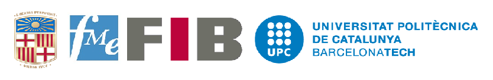

***"Dedicated in the service of the nation"***

    

Welcome to the Leek group in the Data Science Lab and the Department of Biostatistics at the Johns Hopkins Bloomberg School of Health. We are a group of researchers, educators, and data scientists using data to solve problems in molecular biology, human health, meta-research, education, and anything else we think could be useful for the world. We produce data tools and code that you can use for your projects as well. We teach online open classes so you can learn how to use data too. If you think any of this sounds cool consider joining us in working to make the world a better place. If you just want to keep up with everything we are working on, follow Jeff on Twitter https://twitter.com/jtleek.

1. __Social Network Analysis__ - 
2. __Kernel Based Machine Learning__ -  
3. __Statistical Natural Language Processing__ -  

I work on [statistical research](/papers), write [data analysis software](/software), [curate and create data sets](/data), write a [blog about statistics](http://simplystatistics.org).

If you want to keep up with everything we are working on, follow me on Twitter [@acmankit](http://twitter.com/acmankit). The best way to contact me is my gmail account (ankitt.nic@gmail.com) or you could send me a letter at:

C/O Director, MESIO-UPC-UB Program,
Faculty of Mathematics and Statistics (FME),
Universitat Politecnica de Catalunya (UPC), Barcelona

    

------

